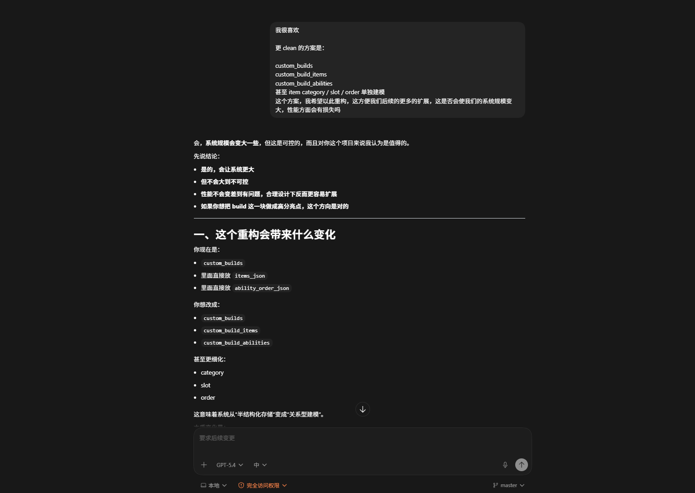
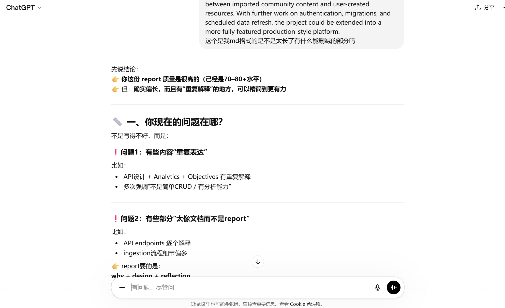
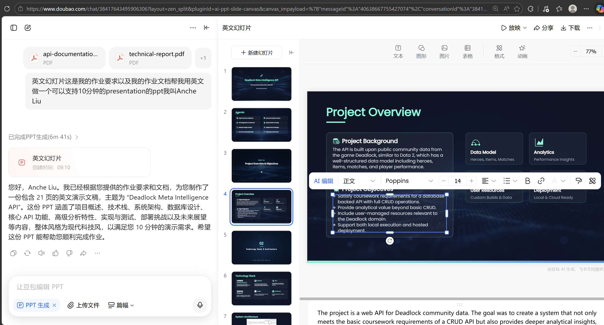

# Generative AI Supplementary Material

## Overview

This supplementary appendix documents representative uses of Generative AI during the development of the Deadlock Meta Intelligence API project. It is not intended to reproduce every conversation in full. Instead, it presents selected examples that show how AI tools were used to support project scoping, design exploration, implementation review, deployment troubleshooting, and documentation refinement.

The project did not rely on AI as an autonomous developer. AI-generated suggestions were treated as draft inputs, alternative viewpoints, or debugging aids. Final implementation choices, scope decisions, validation, and integration work were carried out manually.

## Tools Used

The main tools used were:

- ChatGPT and related GPT-based assistants for design discussion, planning, technical explanation, and critique
- Codex-style coding assistance for implementation support, repository editing, refactoring, and testing workflow guidance
- Doubao for generating an initial presentation draft based on the existing repository and technical documentation
- additional model feedback for reviewing report structure, slide wording, and design justifications from a second perspective

## How AI Was Used

The use of AI in this project can be grouped into four main categories:

- **Scoping and planning:** comparing candidate project directions and identifying a coursework-appropriate scope
- **Design exploration:** evaluating alternative database structures, API shapes, and analytics modules
- **Engineering support:** diagnosing deployment issues, refining implementation decisions, and identifying missing edge cases
- **Documentation review:** improving clarity, concision, and justification in the report and slides
- **Presentation drafting:** generating an initial slide structure from the repository contents and then refining it manually

A consistent review process was applied throughout:

1. use AI to generate or compare candidate approaches
2. check the suggestions against the coursework brief and the actual codebase
3. reject or revise suggestions that were too broad, inaccurate, or impractical
4. implement and test the chosen solution manually

## Example 1: Project Scoping

- **Purpose:** Narrow the project from a general Deadlock-related API idea to a coursework-appropriate analytics API.
- **AI contribution:** AI was used to compare several project directions, including a simple public-data wrapper, a build-management API, and a database-backed analytics API.
- **Outcome:** The final direction combined imported Deadlock data, user-managed resources, and analytical endpoints.
- **Human judgement applied:** The final scope was reduced to a manageable system that still satisfied CRUD, SQL, deployment, testing, and documentation requirements.

Example excerpt:

> AI was asked to compare whether the project should mainly proxy public Deadlock data or instead store imported data locally and build analysis on top of it. The local database-backed approach was selected because it better demonstrated independent engineering work.

## Example 2: Database and API Design

- **Purpose:** Explore a schema and endpoint structure suitable for a high-quality coursework submission.
- **AI contribution:** AI was used to discuss which resource groups should exist, how imported and user-managed data should relate to each other, and how to keep the project coherent rather than becoming a collection of disconnected endpoints.
- **Outcome:** The resulting design separated the API into core imported resources, user-managed resources, and analytics resources.
- **Human judgement applied:** The final design was constrained by implementation time, testing capacity, and the need to keep the API demonstrable within the coursework scope.

Example excerpt:

> AI-assisted planning was used to justify a structure that included imported tables such as heroes, items, matches, and community_builds, alongside user-managed resources such as custom_builds and saved_reports, so that the system would not be limited to read-only endpoints.

## Example 3: Custom Build Redesign

- **Purpose:** Replace an initially simple but less clean custom-build design with a more extensible relational model.
- **AI contribution:** AI was used to compare a JSON-style structure against a normalised relational structure and to reason about the trade-off between simplicity and extensibility.
- **Outcome:** The build subsystem was redesigned into:
  - custom_builds
  - custom_build_items
  - custom_build_abilities
- **Human judgement applied:** The relational design was chosen because it better supported structured responses, cloning from community builds, cleaner future frontend integration, and stronger database design justification in the report.

Example excerpt:

> AI was used to evaluate whether the custom build resource should continue storing item and ability data in JSON-like fields or be refactored into multiple related tables. The final decision was to adopt the relational approach because it was cleaner, easier to extend, and better aligned with the project goals.

*Figure 1. Screenshot of the design discussion used to compare the original JSON-based custom build model with a cleaner relational redesign.*

## Example 4: Deployment Troubleshooting

- **Purpose:** Diagnose and fix deployment issues when hosting the API on Render with PostgreSQL.
- **AI contribution:** AI was used to interpret build logs, identify likely causes, and suggest targeted fixes rather than broad trial-and-error changes.
- **Outcome:** This contributed to fixes such as:
  - normalising PostgreSQL URLs for the psycopg driver
  - pinning Python to a supported version for hosted builds
  - improving environment-based configuration and CORS handling
- **Human judgement applied:** Proposed fixes were checked against official platform behaviour, tested locally where possible, and only then committed and redeployed.

Example excerpt:

> AI-assisted troubleshooting helped identify that the hosted environment was using an unsuitable Python version for the dependency set and that the PostgreSQL connection string needed to be adapted for the SQLAlchemy driver configuration used in the project.

## Example 5: Documentation and Report Refinement

- **Purpose:** Improve the quality of the final written materials.
- **AI contribution:** AI was used not only to draft explanations but also to critique them. A second model was used to review the report structure, identify overlong sections, and suggest where trade-offs and justification could be expressed more clearly.
- **Outcome:** The report and slides became shorter, more design-focused, and more closely aligned with the coursework brief.
- **Human judgement applied:** Final phrasing, emphasis, and evidence selection were decided manually, especially when compressing content to fit page limits and presentation time.

Example excerpt:

> Another model was used to critique the report draft and presentation wording, highlighting places where the text was too descriptive, too long, or not explicit enough about design trade-offs. These comments were then selectively incorporated and manually rewritten.

*Figure 2. Screenshot of AI-assisted critique used to identify repeated content, overly descriptive sections, and places where the report needed stronger design-oriented wording.*

## Example 6: Presentation Drafting and Manual Revision

- **Purpose:** Produce an initial presentation structure efficiently from the implemented system and existing documentation.
- **AI contribution:** Doubao was used to generate a first-pass slide deck based on the current repository, technical documentation, and project scope.
- **Outcome:** The generated deck provided a usable starting point for slide ordering, section grouping, and high-level wording.
- **Human judgement applied:** The presentation was then manually reviewed and revised to remove inaccurate claims, align slide content with the actual implementation, improve wording, and ensure the final slides were appropriate for oral presentation.

Example excerpt:

> Doubao was used to build an initial presentation draft from the repository and documentation, after which the slides were manually checked against the implemented API, corrected where necessary, and refined for accuracy and presentation quality.

*Figure 3. Screenshot of the initial slide deck draft generated from the repository and technical documentation before manual review and revision.*

## Limits of AI Use

AI support was helpful, but it also had clear limitations.

- Some suggestions were initially too broad for the coursework scope and had to be reduced.
- Some wording sounded more confident than the implementation justified and needed to be toned down.
- Some AI-generated presentation wording was too broad or too confident and had to be manually corrected before submission.
- Deployment suggestions still required careful verification against logs and actual runtime behaviour.
- Design proposals were only useful when checked against the real codebase and project constraints.

For that reason, AI outputs were not treated as authoritative. They were treated as prompts for further reasoning, with correctness established through implementation, testing, and manual review.

## Reflection on AI Usage

The use of AI in this project went beyond low-level code generation. It was used to:

- compare alternative project directions
- reason about trade-offs in database and API design
- support a significant relational redesign of the build subsystem
- troubleshoot hosted deployment issues
- critique and refine the final documentation from multiple perspectives

This most closely reflects a methodical medium-to-high level use of Generative AI. The tools accelerated exploration and helped surface alternatives, but they did not replace implementation responsibility, technical judgement, or validation.

## Supporting Evidence

This supplementary material presents selected representative examples rather than a complete transcript of all AI interactions. The examples were chosen because they best illustrate the most significant uses of AI during project scoping, redesign, deployment, and documentation refinement.
