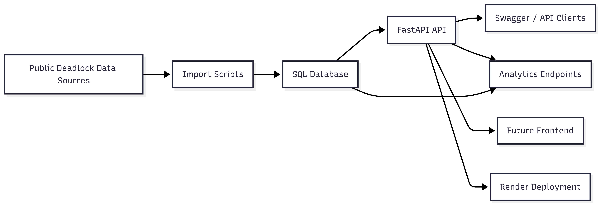
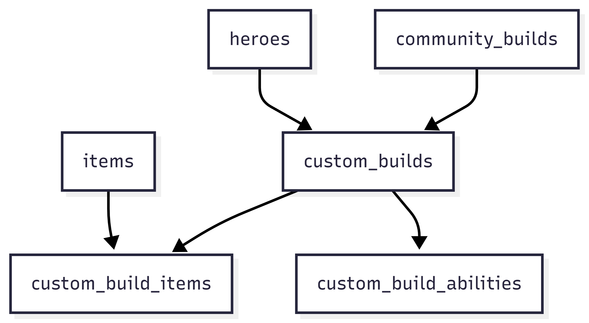

# Technical Report: Deadlock Meta Intelligence API

## 1. Introduction

This project is a web API for importing and analysing public Deadlock community data. Deadlock is a suitable domain because, like Dota 2, it has a simple but layered data structure: heroes, items, matches, player performance, and builds can all be modelled clearly in a relational system. This makes it a good basis for demonstrating CRUD, analytics, testing, and deployment within one coursework project.

The system was designed as an independent API rather than a proxy to a third-party source. Public data is imported into a local SQL database and then served through custom endpoints and analytics.

## 2. Objectives

The project had four main objectives:

- satisfy the coursework minimum requirements for a database-backed API with full CRUD and multiple HTTP endpoints
- provide analytical value beyond simple CRUD
- include user-managed resources that make sense for the Deadlock domain
- support both local execution and hosted deployment

These objectives collectively guided the design of a system that integrates imported data, user-managed resources, and analytical endpoints into a unified API.

## 3. Technology Choices

Python and FastAPI were selected because they provide rapid API development, automatic OpenAPI documentation, and a strong ecosystem for data processing. Compared to heavier frameworks such as Django, FastAPI provides a more lightweight and efficient approach for building a data-driven API of this size.

SQLAlchemy was used for relational modelling and query construction. SQLite was used for local development to keep setup lightweight, while PostgreSQL was chosen for deployment because it is a more realistic production database and better suited to relational analytics. Pytest was used for automated testing, and Render was used for deployment.

## 4. Data Sources and Ingestion

The API uses public Deadlock community data for heroes, items, recent matches, and community builds. Instead of forwarding requests directly to an upstream service, the system imports the data into its own database. This improves stability, gives control over schema design, and enables analytics over local data.

The ingestion workflow is simple:

1. Fetch JSON from a public source.
2. Map fields to the local schema.
3. Insert or update local records.
4. Serve the imported data through the API.

This process is implemented through standalone scripts for heroes, items, matches, and community builds.

## 5. Architecture

The project uses a modular structure:

- `app/api/routes/` for HTTP routes
- `app/models/` for SQLAlchemy models
- `app/schemas/` for request and response models
- `app/db/` for engine and session setup
- `app/core/` for configuration
- `scripts/` for data import
- `tests/` for automated validation

This separation keeps request handling, persistence, validation, and ingestion logic distinct. It also preserves frontend extensibility because the backend remains a clean HTTP API. Figure 1 summarises the overall architecture.

Figure 1. High-level architecture showing public data ingestion, relational storage, API delivery, analytics, and deployment.

## 6. Database Design

The schema is built around imported reference and fact tables plus user-managed tables.

Key imported tables are:

- `heroes`
- `items`
- `matches`
- `match_participants`
- `community_builds`

Key user-managed tables are:

- `custom_builds`
- `saved_reports`

One of the main architectural improvements in the project was the redesign of the custom build model. The initial implementation stored item and ability data in JSON-like fields, which worked for early development but was not especially clean or extensible. This was refactored into:

- `custom_builds`
- `custom_build_items`
- `custom_build_abilities`

This relational redesign made the build workflow clearer, improved the API response structure, and better supports future frontend editors, build comparison, and PostgreSQL deployment. Figure 2 shows the relational build model introduced by this refactor.

Figure 2. Relational build model used to support editable custom builds and community-build cloning.

## 7. API Design

The API is divided into five groups:

- core resources
- community builds
- custom builds
- saved reports
- analytics

Core endpoints expose imported heroes, items, matches, and community builds. `custom_builds` and `saved_reports` both provide full CRUD functionality and satisfy the coursework requirement for database-backed resources.

A particularly important workflow is `POST /community-builds/{id}/clone-to-custom`, which converts imported public build data into an editable custom build. This connects imported data with user-created data and makes the system more coherent than a set of isolated endpoints.

The API returns JSON throughout and uses standard error codes such as `404 Not Found` for missing resources and `400 Bad Request` for invalid saved report result requests.

## 8. Analytics Design

The analytics layer is the main feature that differentiates the project from a basic CRUD API. It uses imported `match_participants` data to generate:

- hero meta rankings
- hero overview statistics
- time-based hero trends
- hero matchup statistics
- hero synergy statistics

These endpoints use aggregation queries and participant self-joins. The same analytics logic is reused by `GET /saved-reports/{id}/result`, which allows saved report presets to produce real result payloads rather than only storing filters.

This elevates the API from a data access service to a data analysis service.

## 9. Testing and Validation

Automated testing was implemented using Pytest. Test coverage includes:

- service health
- imported resource endpoints
- custom build CRUD
- saved report CRUD
- saved report result generation
- community build cloning
- analytics endpoints
- match date filtering behaviour

The tests use an isolated SQLite configuration so that test runs do not alter the local development database. The deployed API was also manually validated through the hosted Swagger UI after seeding PostgreSQL with imported data.

This ensured both functional correctness and stability across core API features.

## 10. Deployment

The deployed system runs on Render with a PostgreSQL database. Deployment configuration is stored in `render.yaml`, which makes the setup explicit and repeatable.

Several practical deployment issues had to be resolved:

- Python version had to be pinned to avoid dependency build failures
- PostgreSQL URLs had to be normalised for the `psycopg` driver
- CORS settings had to be externalised to preserve future frontend flexibility

These issues were useful because they exposed real deployment constraints beyond local development.

## 11. Limitations and Future Work

The current system has several limitations. It does not yet include authentication, imported match samples are still relatively small, and the application still uses `create_all` rather than a full migration workflow. There is also no dedicated frontend yet, although the API was structured to remain frontend-friendly through JSON responses, relational custom builds, and configurable CORS.

Future work would include authentication, larger scheduled data imports, richer analytics filters, build comparison features, and a lightweight frontend dashboard.

## 12. Generative AI Declaration and Reflection

Generative AI was used throughout the project in a declared and methodical way. It was used for project scoping, endpoint and database design, analytics planning, redesign of the custom build model, deployment troubleshooting, and documentation support. It was also used reflectively, for example by asking another model to critique report phrasing and design decisions so that the final submission could be refined further.

This was more than low-level syntax assistance; it was used to explore alternatives and improve the overall design of the solution. All AI-assisted suggestions were reviewed before adoption and, in several cases, refined or restructured before implementation. Selected example conversation logs will be attached separately as supplementary material.

## 13. Conclusion

This project delivers a complete Deadlock-focused analytics API that meets the coursework requirements while going beyond the minimum technical threshold. Its strongest elements are the analytics layer, the relational redesign of custom builds, and the integration between imported community content and user-managed resources. With further work on authentication, migrations, and frontend presentation, it could be extended into a more complete production-style platform.
